# 
<a href="Lichen_Wu.pdf">CV</a>

*--updated 02.24.2020*

## Shan-Chen gas liquid model(Lattice-Boltzmann Methods)

<table><tr><td>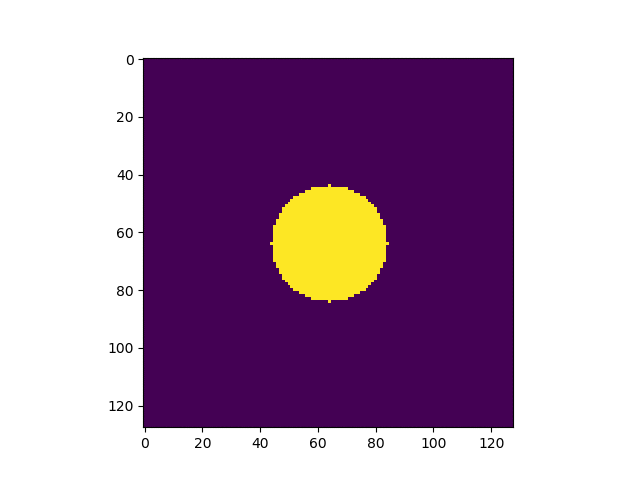</td><td>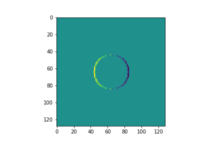</td></tr></table>

### References:
* https://github.com/shurikkuzmin/LatticeBoltzmannMethod

## Finite Volume Methods
Governing equations: Navier-Stokes equations.

  
  
  

<table><tr><td>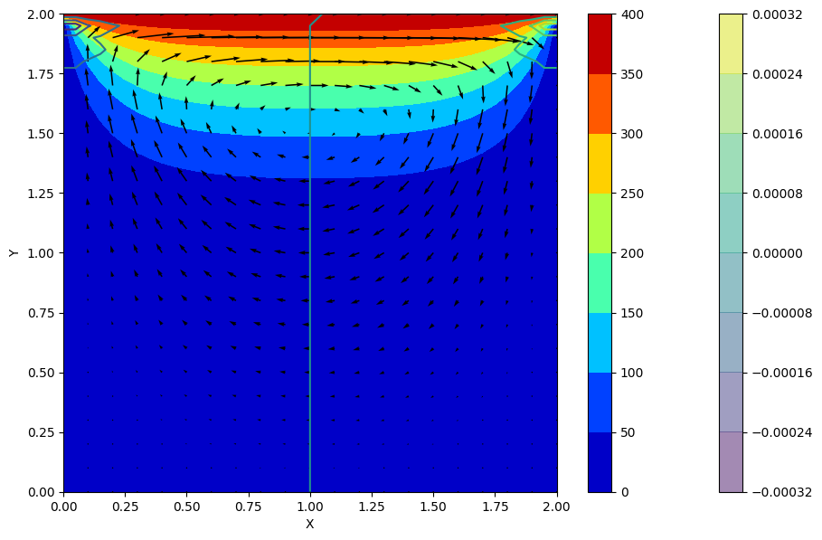</td><td>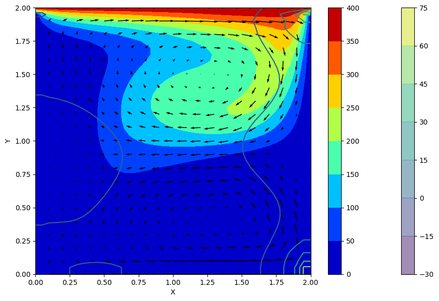</td></tr></table>

### References:
* https://github.com/barbagroup/CFDPython/blob/master/README.md
* https://en.wikipedia.org/wiki/Derivation_of_the_Navier%E2%80%93Stokes_equations
* https://en.wikipedia.org/wiki/Navier%E2%80%93Stokes_equations

## Gasussian Process or Global Optimization from Machine Learning

  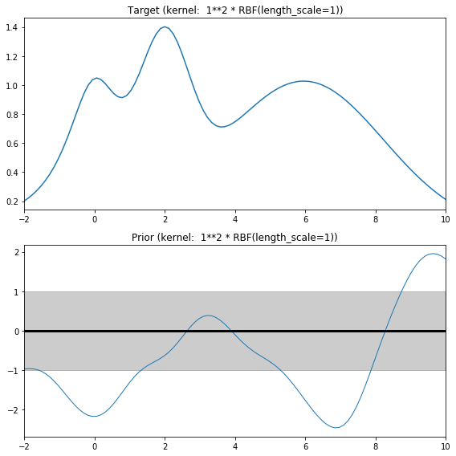
  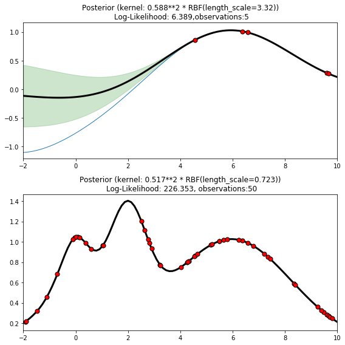

### References:
* https://scikit-learn.org/stable/auto_examples/gaussian_process/plot_gpr_prior_posterior.html#sphx-glr-auto-examples-gaussian-process-plot-gpr-prior-posterior-py
* https://github.com/fmfn/BayesianOptimization

## <a href="matlabwebpage/SIMPLEcorrect.html/">Semi-Implicit Methods for Pressure Linked Equations</a>
<table><tr><td>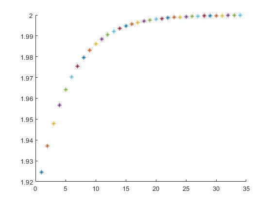</td><td>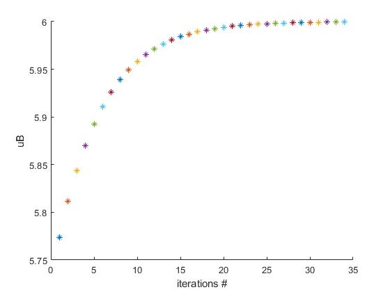</td><td>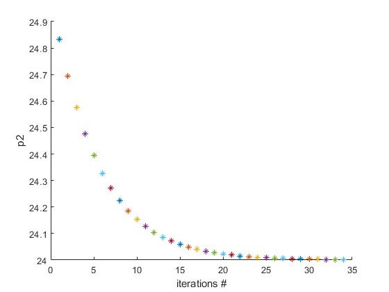</td></tr></table>

### References:
* https://www.youtube.com/watch?v=xPnzJ4gt9eE
* http://ftp.demec.ufpr.br/disciplinas/TM702/Versteeg_Malalasekera_2ed.pdf

## Second Virial Coefficients
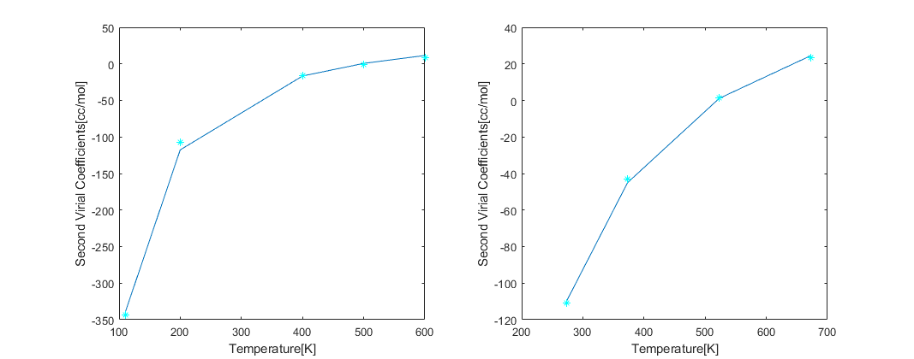

### References:
An Introduction to Applied Statistical Thermodynamics by Stanley I. Sandler

## HotroomBoussinesq-OpenFOAM

<table><tr><td>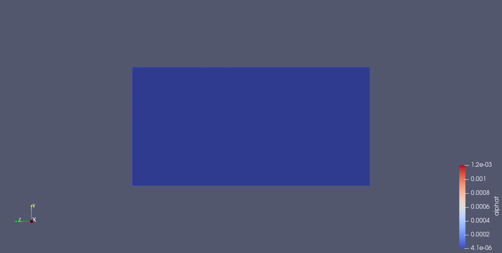</td><td>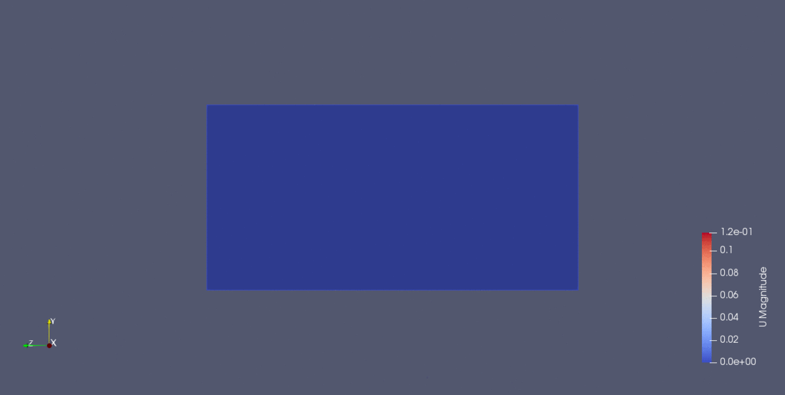</td></tr></table>

## BuoyantEffect-OpenFOAM
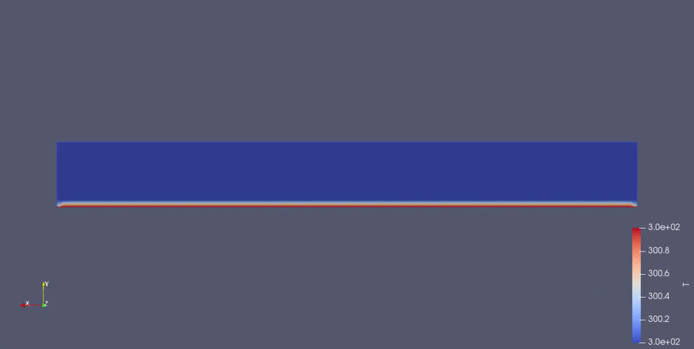

## HotroomRadiation-OpenFOAM
<table><tr><td>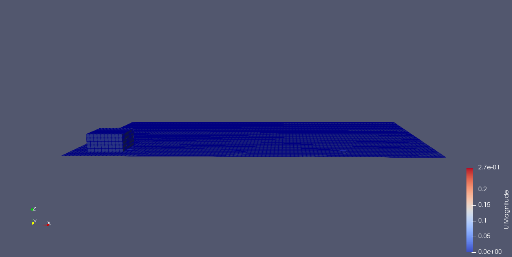</td><td>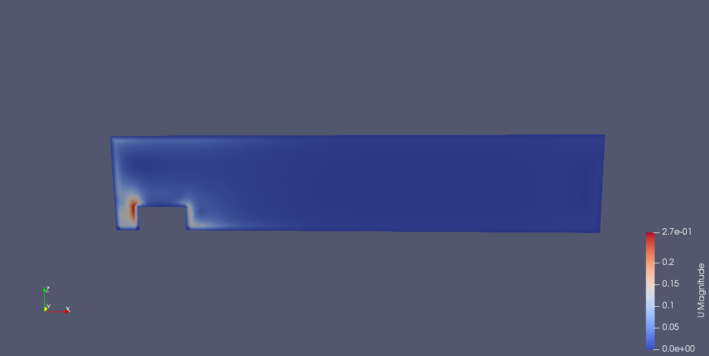</td></tr></table>

### References:
* https://cfd.direct/openfoam/user-guide/v7-standard-solvers/#x13-1030003.5.7

## Courses

  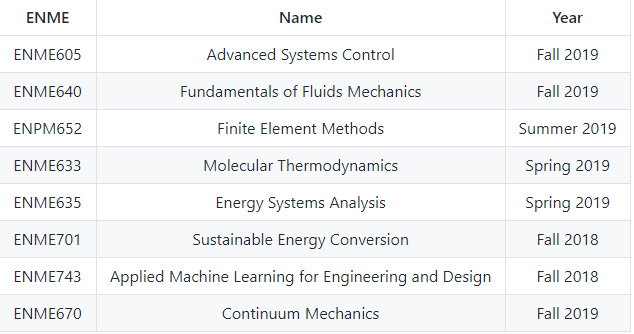

## Questions for next step

### CFD
simulationType are laminar, RAS and LES
what is tolerances, relax factor?
### Optimization
why fminsearch in matlab is so different with optimize.fmin in python

how to tune in hyperparemeters?

how to decrease big O notation?

how to calculate convariance? if we have infinite variables
### Linux 
  

